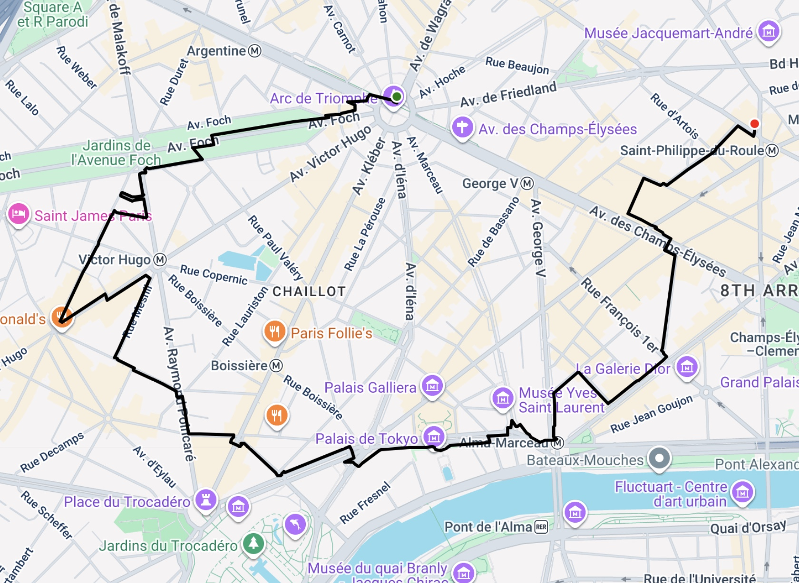

# RhythmHaxx
RhythmHacks Hackathon Project
# Draw2Route

## Overview
**Draw2Route** converts a user-drawn line (a list of GPS points) into a realistic walking route that aligns with real-world roads.  
It uses **OpenStreetMap** data through the **OSMnx** library to find the most accurate path that matches the shape of the drawing.

## How It Works
1. **Input:**  
   Takes a list of GPS coordinates (points) and a flag to optionally use the OpenStreetMap API.
2. **Bounding Box:**  
   Builds a small bounding box around the drawing, padded with extra space to define the area of interest.
3. **Graph Construction:**  
   Downloads a walkable street network from OpenStreetMap within the bounding box.
4. **Projection:**  
   Projects both the map data and input points into a common coordinate system for accurate distance calculations.
5. **Start/End Nodes:**  
   Finds the closest nodes in the graph to the start and end points of the drawing.
6. **Penalty Weighting:**  
   Roads farther from the drawn shape are assigned higher penalties to discourage deviation.
7. **Route Calculation:**  
   Runs a shortest-path algorithm to find the optimal walking route that best fits the drawing.
8. **Output:**  
   Returns the route as a list of GPS coordinates in WGS84 format.

   `Created by Andrii Bessarab, Adam Turaj, Jason Liang, and Jack Brown`
